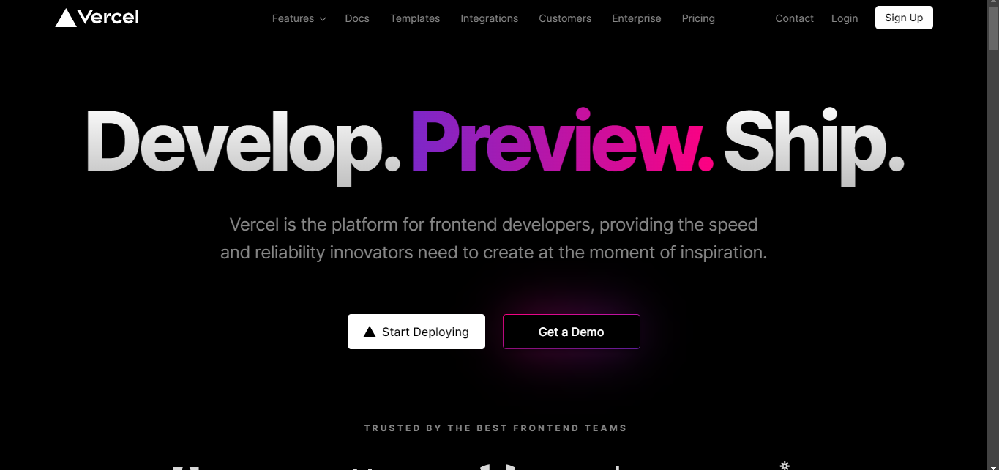

# Vercel-deployments

1. إنشاء حساب Vercel: يجب عليك أولاً إنشاء حساب على Vercel. يمكنك التسجيل في حساب مجاني على موقع Vercel او استخدام حسابك في github.   

   

اختار `Start deploying` .   

   

ربط حساب github  عن طريق `Continue with GitHub` .   

   

ادخل بيانات حسابك في `GitHub`و اعطى الصلاحيات باختسار `Authorize Vercel`  .   

   

2. ربط مستودع Git: بعد إنشاء حساب، أو ربط حسابك  يمكنك ربط مستودع Git الخاص بك بـ Vercel. تدعم Vercel مستودعات Git المستضافة على GitHub و GitLab و Bitbucket, بعد اختيار المشروع نقوم بعمل  `import`    

   

يمكنك ربط مستودعك باستخدام لوحة Vercel أو باستخدام Vercel CLI .   

يمكنك أيضا إنشاء مشروع: بعد ربط مستودع Git الخاص بك، يمكنك إنشاء مشروع جديد في Vercel. يمكنك إنشاء مشروع من الصفر أو اختيار واحد من القوالب المُعدّة مسبقًا. يدعم Vercel مجموعة متنوعة من الإطارات الأمامية الشائعة، بما في ذلك React و Next.js و  Vue.js.   
   

4. ضبط إعدادات النشر: قبل نشر مشروعك، يجب عليك ضبط إعدادات النشر. يتضمن ذلك تحديد الفرع للنشر، والأمر الذي يتم بناء المشروع به، ودليل الإخراج
.
5. نشر مشروعك: بعد ضبط إعدادات النشر، يمكنك نشر مشروعك على منصة Vercel. باختيار `Deploy`   

   

يمكنك نشر مشروعك باستخدام لوحة Vercel أو Vercel CLI، أو من خلال التكامل مع  قائمة الأوامر الخاص بك.   

6. مراقبة وإدارة النشر الخاص بك: بعد نشر مشروعك، يمكنك مراقبة وإدارة النشر الخاص بك باستخدام لوحة Vercel. يمكنك عرض المقاييس مثل وقت الاستجابة وحجم الطلب ومعدل الخطأ، ويمكنك أيضًا تكبير النشر الخاص بك أو تصغيره حسب الحاجة.   

   

بعض المصادر الإضافية للمساعدة في البدء باستخدام منصة Vercel:   

مستندات Vercel: تتضمن مستندات Vercel معلومات مفصلة حول كيفية استخدام المنصة وإنشاء ونشر تطبيقات الويب [Vercel.com](https://vercel.com/docs/concepts/get-started).    

منتدى Vercel: يتضمن منتدى Vercel مجتمعًا نشطًا من المستخدمين والمطورين الذين يمكنهم تقديم المساعدة والنصائح والحلول للمشاكل المختلفة [Vercel.blog](https://vercel.com/blog).   

باستخدام هذه المصادر، يمكنك الحصول على مزيد من المعلومات والمساعدة في البدء باستخدام Vercel وتحقيق أهدافك في تطوير التطبيقات الويب.   

